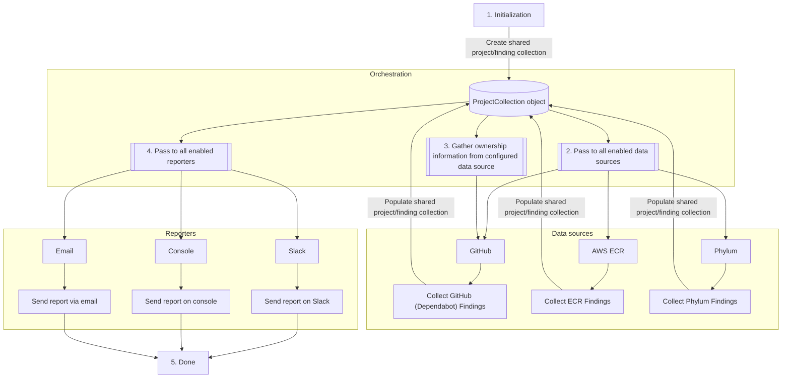

# Data Flow in Vulnbot

Vulnbot does a whole lot of work, and the way that data is moved around and
orchestrated can easily get confusing without an intimate understanding of the
code. Here, we will attempt to break down how all of the data flows through the
application. Let's start with a high level diagram. Note that this diagram may
also represent features which are not yet implemented, but the overall flow
is/will remain accurate.

Now for a more in-dept explanation of what's happening:

1. **Initialization**

   During the main initialization, `vulnbot` will create a single global
   `ProjectCollection` object. For a variety of reasons, this single object is
   shared by all data sources and reporters.

1. **Pass to all enabled data sources**

   Each data source is responsible for adding and updating its own discovered
   projects and findings to this collection. These operations must be handled
   via the `collection.GetProject()` and `project.GetFinding()` methods. These
   methods are built to handle all necessary normalization, matching, and
   locking for concurrent access.

1. **Gather ownership information from configured data source**

   Once all projects and findings have been gathered from all data sources,
   `vulnbot` will then make a call to the data source which has been configured
   as the canonical source for ownership. This ownership data is added to the
   projects and findings that were collected by all data sources.

   > **Note**
   > This is currently a hard-coded call to the GitHub data source, until such
   > time as other ownership sources have been built.

1. **Pass to all enabled reporters**

   Once all projects and findings have been collected, and ownership has been
   assigned to them, this `ProjectCollection` is passed on to each of the
   reporters to send out their individual reports. At this point, the data in
   the collection should be considered immutable.

1. **Done**

   All done!
